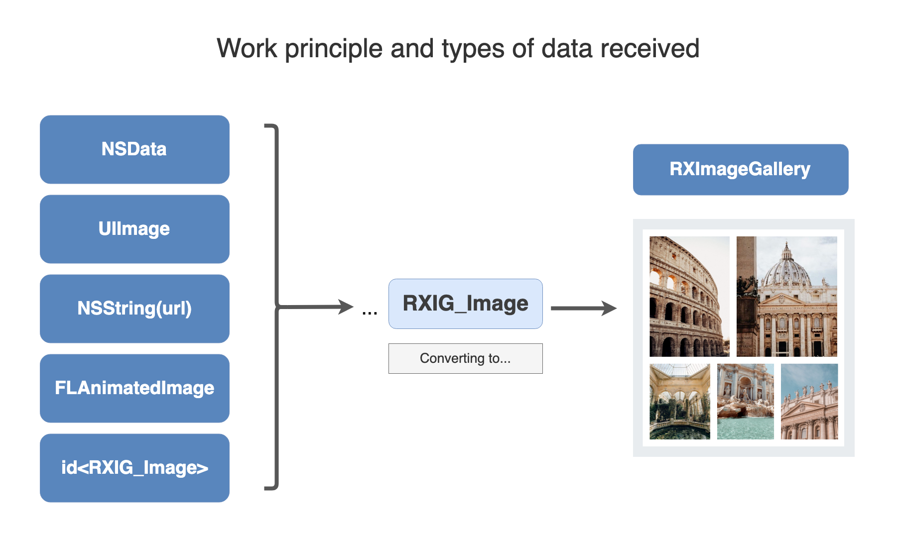
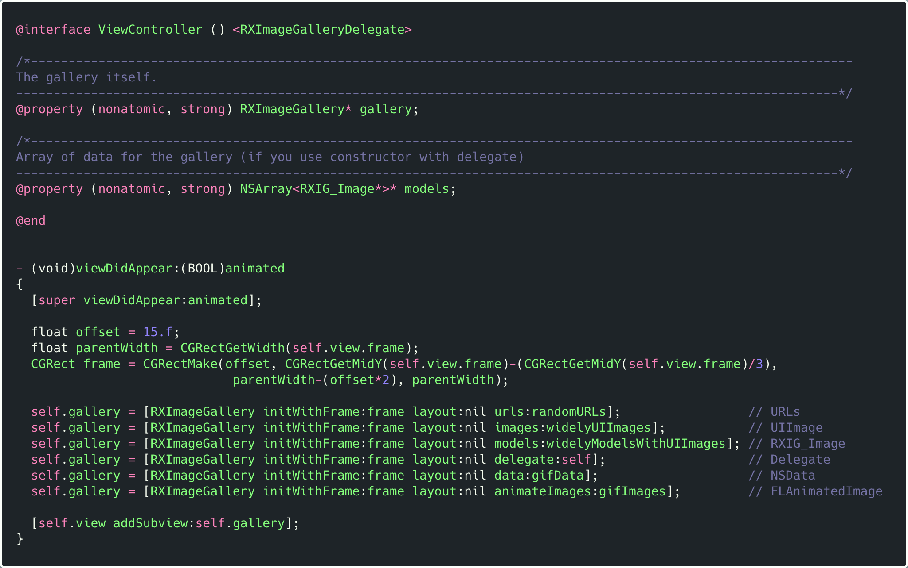
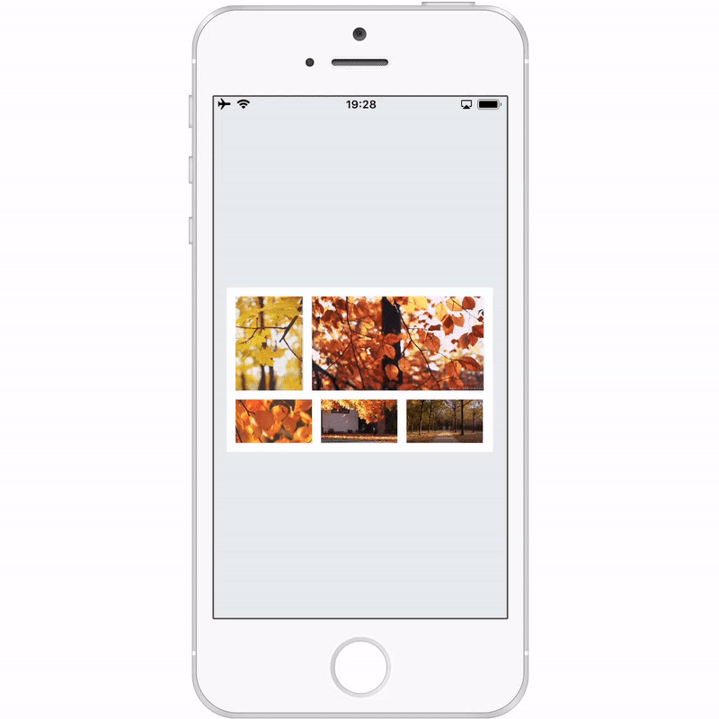
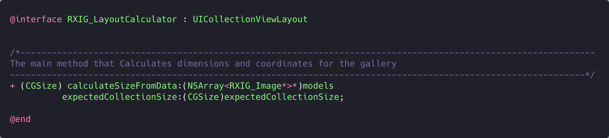
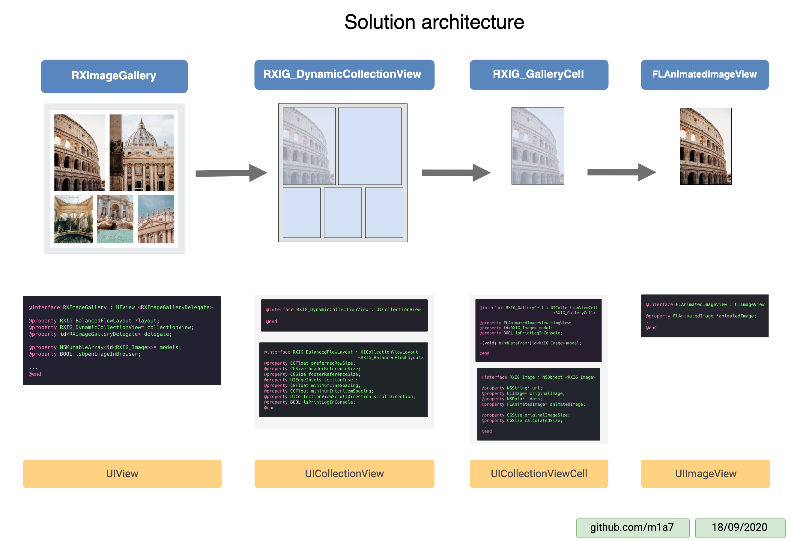
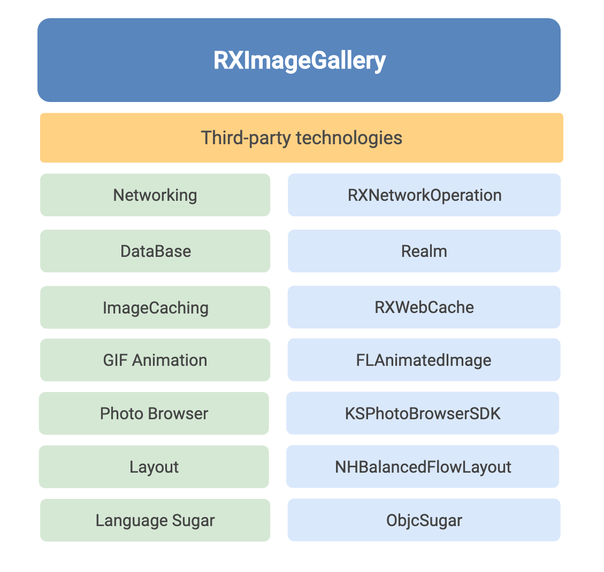

# RXImageGallerySDK


# 

# Оглавление

- [💎 Определение](#-определение)
- [⁉️ Причина для создания RXImageGallerySDK](#%EF%B8%8F-причина-для-создания-rximagegallerysdk)
- [📜 История создания](#-история-создания)
- [💡 Концепция](#-концепция)
- [💼 Сниппеты кода](#--сниппеты-кода)
- [📦 Прочие моменты в использовании библиотеки](#-прочие-моменты-в-использовании-библиотеки)
  - [Браузер для просмотра фотографий](#браузер-для-просмотра-фотографий)
  - [Работа с gif анимацией](#работа-с-gif-анимацией)
  - [Поддержка ориентаций устройства](#поддержка-ориентаций-устройства)
  - [Рассчет размеров галлереи](#рассчет-размеров-галлереи)
- [📃 Архитектура решения](#-архитектура-решения)
- [📲 Совместимость](#-совместимость)
- [🧬 Используемые технологии](#-используемые-технологии)
- [👨🏼‍💻 Автор](#-автор)
- [👀 Дополнительно](#-дополнительно)

<br>

## 💎 **Определение**

**RXImageGallerySDK** - библиотека для компоновки фотографии в коллажи.

<br>


<br>

## ⁉️ Причина для создания RXImageGallerySDK

По умолчанию `iOS` не имеет компонента который, может динамически компоновать фотографии в заданном прямоугольнике, по образу и подобию как это происходит в приложениях `Facebook`/`VK` при добавлении фотографий к посту.

**UPD**.
В `iOS 13` появилась технология `compositional layout`, которая может выполнить похожую задачу.
Но если ваш проект должен поддерживать более низкие версии ОС, то единственное решение это **RXImageGallerySDK**.

<br>

## 📜 **История создания**

Поскольку подобное `UI` решение достаточно широко распространенно среди дизайнеров, было принято решение создать `UI` компонент. 

| Vk app                                   | Fb app                                   |
|:----------------------------------------:|:----------------------------------------:|
|  |  |

Основное требования во время разработки элемента было - простота в использовании конечным пользователем класса, и максимальная гибкость.



Таким образом был создан фраемворк который работает с любым типом данных и выполняет за вас большое количество работы.  

Вам же в свою очередь нужно потратить всего несколько строк на инициализацию и добавление элемента на экран.  

Все внутренние алгоритмы библиотеки были дополнительно оптимизированы для корректной работы даже на самых слабых устройствах.

<br>

## 💡 Концепция

 **Принцип работы и типы принимаемых данных**

Класс **RXImageGallery** принимает данные разных типов, в последствие конвертирует их в объекты `RXIG_Image`.  



 А далее в зависимости от полученных данных начинают выполняться разные сценарии построения интерфейса.  

Например, если вы передали массив ссылок, то библиотека самостоятельно скачает и за кэширует картинки.

<br>

## 💼  Сниппеты кода

В примере ниже рассмотрены все возможные варианты инициализации галереи.
[Copy code](Documentation/TextSnippet/using-case.txt)



**Работа с делегатом**

Если по каким либо причинам вы не можете передать массив данных для построения галереи, то вы можете воспользоваться вариантом инициализации с помощью делегата.

Тогда вам нужно будет предоставлять каждую модель по отдельности.

```objectivec
#pragma mark - <RXImageGalleryDelegate>

/*--------------------------------------------------------------------------------------------------------------
  The following methods are implemented that can be called if 'RXImageGallery' was used during initialization
  the '-initWithFrame:layout:delegate: 'method.
  ⚠️ If you use other constructors, you don't need to implement these methods.
 --------------------------------------------------------------------------------------------------------------*/

////////////////////////////////////////////////////////////////////////////////////////////////////////////////////////////////
/*
  __  .___  ___.      ___       _______  _______      _______      ___       __       __       _______ .______     ____    ____
 |  | |   \/   |     /   \     /  _____||   ____|    /  _____|    /   \     |  |     |  |     |   ____||   _  \    \   \  /   /
 |  | |  \  /  |    /  ^  \   |  |  __  |  |__      |  |  __     /  ^  \    |  |     |  |     |  |__   |  |_)  |    \   \/   /
 |  | |  |\/|  |   /  /_\  \  |  | |_ | |   __|     |  | |_ |   /  /_\  \   |  |     |  |     |   __|  |      /      \_    _/
 |  | |  |  |  |  /  _____  \ |  |__| | |  |____    |  |__| |  /  _____  \  |  `----.|  `----.|  |____ |  |\  \----.   |  |
 |__| |__|  |__| /__/     \__\ \______| |_______|    \______| /__/     \__\ |_______||_______||_______|| _| `._____|   |__|
 */
////////////////////////////////////////////////////////////////////////////////////////////////////////////////////////////////


/*--------------------------------------------------------------------------------------------------------------
 Returns the number of sections for the gallery. By default, the value '1' should be returned.
 --------------------------------------------------------------------------------------------------------------*/
- (NSInteger)numberOfSectionsInCollectionView:(UICollectionView *)collectionView
{
   return ([self.models count]>0) ? 1 : 0;
}


/*--------------------------------------------------------------------------------------------------------------
 Returns the number of photos that will be displayed in the gallery
 --------------------------------------------------------------------------------------------------------------*/
- (NSInteger)collectionView:(UICollectionView *)view numberOfItemsInSection:(NSInteger)section
{
    return [self.models count];
}

/*--------------------------------------------------------------------------------------------------------------
 Initializes a cell for the gallery.
 You must return a cell that comforms '<RXIG_GalleryCell>' protocol.
 --------------------------------------------------------------------------------------------------------------*/
- (UICollectionViewCell *)collectionView:(UICollectionView *)collectionView cellForItemAtIndexPath:(NSIndexPath *)indexPath
{
    RXIG_GalleryCell *cell = [collectionView dequeueReusableCellWithReuseIdentifier:@"RXIG_GalleryCell" forIndexPath:indexPath];
    cell.model = self.models[indexPath.item];
    return cell;
}


/*--------------------------------------------------------------------------------------------------------------
The method is called by the gallery to change its own size after calculating the coordinates and sizes of images
 --------------------------------------------------------------------------------------------------------------*/
- (void) collectionViewDidResized:(CGSize)collectionViewSize
{
    self.gallery.frame = CGRectMake(self.gallery.frame.origin.x, self.gallery.frame.origin.y, collectionViewSize.width, collectionViewSize.height);

}

/*--------------------------------------------------------------------------------------------------------------
 The method should return the original size of the image that will be placed in the gallery.
 --------------------------------------------------------------------------------------------------------------*/
- (CGSize) collectionView:(UICollectionView *)collectionView layout:(id<RXIG_BalancedFlowLayout>)collectionViewLayout preferredSizeForItemAtIndexPath:(NSIndexPath *)indexPath
{
    return self.models[indexPath.item].originalImageSize;
}

/*--------------------------------------------------------------------------------------------------------------
 This method is called after clicking on images in the gallery
 --------------------------------------------------------------------------------------------------------------*/
- (void)collectionView:(UICollectionView *)collectionView didSelectItemAtIndexPath:(NSIndexPath *)indexPath
{
    [collectionView deselectItemAtIndexPath:indexPath animated:YES];
    // If you want here you can implement the logic of opening a photo in your own browser
}
```

<br>

## 📦 Прочие моменты в использовании библиотеки

#### Браузер для просмотра фотографий.

По умолчанию если Вы не переопределите метод `collectionView:didSelectItemAtIndexPath:` (используя вариант работы с делегатом) и не реализуете собственную логику просмотра фотографий в увеличенном размере, то фраемворк это сделает за вас.

Для возможности открытия фотографии в полноэкранном режиме используется модернизированный код библиотеки []([KSPhotoBrowser](https://github.com/skx926/KSPhotoBrowser)).

Если вы хотите запретить пользователю открывать фотографии в полноэкранном режиме, то измените значение переменной `isOpenImageInBrowser`.

```objectivec
@interface RXImageGallery : UIView <RXImageGalleryDelegate>
...
/*--------------------------------------------------------------------------------------------------------------
 By default, the property is set to 'YES'. If the value is 'YES', after clicking on the image, it will be 
 opened in a special browser for photos.
 --------------------------------------------------------------------------------------------------------------*/
@property (nonatomic, assign) BOOL isOpenImageInBrowser;

@end
```

---

#### Работа с gif анимацией

 Также в фраемворке по умолчанию реализована поддержка гиф изображений. 
 Для этого вам ничего не нужно дописывать самостоятельно.
 Гиф картинку вы можете передать в конструктор галереи как `NSData`, как` NSString(url)` или как `FLAnimatedImage`.

 Работа с анимацией была построена на основе кода библиотеки [FLAnimatedImage]([](https://github.com/Flipboard/FLAnimatedImage)).



---

#### Поддержка ориентаций устройства

По умолчанию при смене ориентации устройства `UICollectionView` внутри галереи будет перерисован, что означает, что все элементы галереи будут адаптированы под новый размер.

---

#### Рассчет размеров галлереи

Если вы создаете табличное представление в котором в каждой из ячеек возможно наличие от одного до нескольких изображений, то для написания высоко-оптимизированного кода вам требуется изначально знать высоту каждой ячейки, которую вы передадите в соответствующие методы делегата таблицы.

Для того чтобы вычислить размеры будущей галереи не создавая ее, был разработан класс **RXIG_LayoutCalculator**.



Который имеет единственный метод `+calculateSizeFromData:expectedCollectionSize:`, в который вам нужно передать массив моделей и `CGSize` прямоугольника в который вы его хотите поместить.

Алгоритм возьмет большое значение из структуры (высоту или ширину), и относительно этого значения рассчитает значение другого параметра. И он вернет окончательный размер галереи.

Точно такой же принцип расчета размеров галереи будет работать и при создании ее самой.
То есть вы передаете некий `frame` относительно которого будет производиться расчет, а далее сама `RXImageGallery` поменяет свой размер (например высоту), увеличив или уменьшив ее.

<br>

## 📃 Архитектура решения

[Full Image](https://github.com/m1a7/RXImageGallery-Documentation/blob/master/Documentation/Images/SolutionArchitecture.png)



<br>

## 📲 **Совместимость**

Фреймворк был написан на языке `Objective-c`, что позволяет фраемворку быть совместимым как с проектами `ObjC`, так и с `Swift`.

| **Objective-c Projects** | **Swift Projects** | **Minimum ios version** |
| ------------------------ | ------------------ | ----------------------- |
| ✅                        | ✅                  | ios 8+                  |

<br>

## 🧬 Используемые технологии

Для собственного функционирования фраемворк использует модифицированный код других библиотек.
Модификации были подвергнуты `KSPhotoBrowser`, `NHBalancedFlowLayout`, `ObjectiveSugar`.



## 👨🏼‍💻 Автор

[👨🏼‍💻 @m1a7](https://github.com/m1a7/RXImageGallery-Documentation/blob/master/github.com/m1a7)  
👌🏻 [thisismymail03@gmail.com](mailto:thisismymail03@gmail.com)

💼 **RXImageGallery** - это приватная технология с закрытым исходным кодом.

<br>

## 👀 **Дополнительно**

[🇬🇧 English Readme](README.md)
