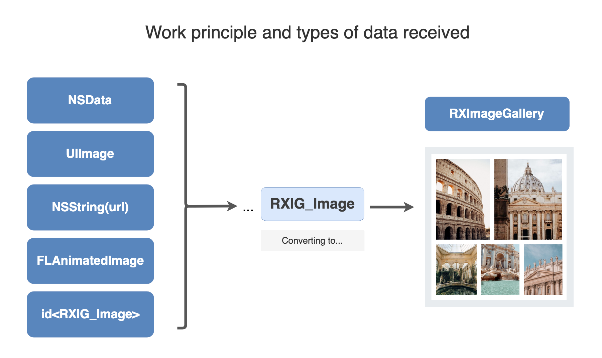
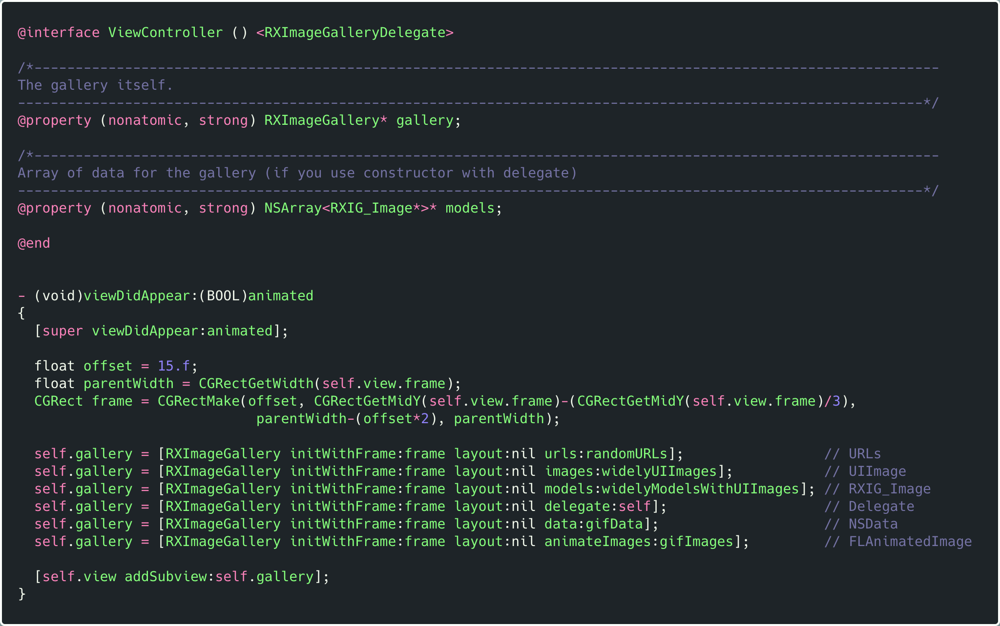

# RXImageGallerySDK


# 

# Table of contents

- [💎 Definition](#-Definition)
- [⁉️ Reason for creating RXImageGallerySDK](#%EF%B8%8F-Reason-for-creating-RXImageGallerySDK)
- [📜 History of creation](#-History-of-creation)
- [💡 Concept](#-Concept)
- [💼 Snippets of code](#--Snippets-of-code)
- [📦 Other aspects of using the library](#-Other-aspects-of-using-the-library)
  - [Browser for viewing photos](#Browser-for-viewing-photos)
  - [Working with gif animation](#Working-with-gif-animation)
  - [Support device's orientations](#Support-device's-orientations)
  - [Calculate the size of the gallery](#Calculate-the-size-of-the-gallery)
- [📃 Solution architecture](#-Solution-architecture)
- [📲 Compatibility](#-Compatibility)
- [🧬 Used technologies](#-Used-technologies)
- [👨🏼‍💻 Author](#-Author)
- [👀 Additionally](#-Additionally)

<br>

## 💎 **Definition**

**RXImageGallerySDK** - library for composing photos into collages.

<br>


<br>

## ⁉️ Reason for creating RXImageGallerySDK

By default, `iOS` doesn't have a component that can dynamically compose photos in a given rectangle, in the same way as it does in the `Facebook`/`VK` apps when adding photos to a post.

**UPD**.

`IOS 13` introduces the `compositional layout` technology that can accomplish a similar task. But if your project needs to support lower OS versions, then the only solution is **RXImageGallerySDK**.

<br>

## 📜 **History of creation**

Since such a `UI` solution is quite widespread among designers, it was decided to create a `UI` component.

| Vk app                                   | Fb app                                   |
|:----------------------------------------:|:----------------------------------------:|
|  |  |

The main requirements during the development of the element were-ease of use by the end user of the class, and maximum flexibility.

In this way, a framework was created that works with any type of data and performs a large amount of work for you.

You, in turn, only need to spend a few lines initializing and adding an element to the screen.

All the library's internal algorithms have been further optimized to work correctly even on the weakest devices.

<br>

## 💡 Concept

 **Operating principle and types of data received**

The **RXImageGallery** class accepts data of different types and then converts them to `RXIG_Imagу` objects.



 And then, depending on the received data, different scenarios for building the interface begin to be executed.

For example, if you passed an array of links, the library will download and cache the images itself.

<br>

## 💼  Snippets of code

The example below shows all possible options for initializing the gallery.

[Copy code](Documentation/TextSnippet/using-case.txt)



**Working with a delegate**

If for some reason you can't pass an array of data to build the gallery, you can use the initialization option using a delegate.

Then you will need to provide each model separately.

```objectivec
#pragma mark - <RXImageGalleryDelegate>

/*--------------------------------------------------------------------------------------------------------------
  The following methods are implemented that can be called if 'RXImageGallery' was used during initialization
  the '-initWithFrame:layout:delegate: 'method.
  ⚠️ If you use other constructors, you don't need to implement these methods.
 --------------------------------------------------------------------------------------------------------------*/

////////////////////////////////////////////////////////////////////////////////////////////////////////////////////////////////
/*
  __  .___  ___.      ___       _______  _______      _______      ___       __       __       _______ .______     ____    ____
 |  | |   \/   |     /   \     /  _____||   ____|    /  _____|    /   \     |  |     |  |     |   ____||   _  \    \   \  /   /
 |  | |  \  /  |    /  ^  \   |  |  __  |  |__      |  |  __     /  ^  \    |  |     |  |     |  |__   |  |_)  |    \   \/   /
 |  | |  |\/|  |   /  /_\  \  |  | |_ | |   __|     |  | |_ |   /  /_\  \   |  |     |  |     |   __|  |      /      \_    _/
 |  | |  |  |  |  /  _____  \ |  |__| | |  |____    |  |__| |  /  _____  \  |  `----.|  `----.|  |____ |  |\  \----.   |  |
 |__| |__|  |__| /__/     \__\ \______| |_______|    \______| /__/     \__\ |_______||_______||_______|| _| `._____|   |__|
 */
////////////////////////////////////////////////////////////////////////////////////////////////////////////////////////////////


/*--------------------------------------------------------------------------------------------------------------
 Returns the number of sections for the gallery. By default, the value '1' should be returned.
 --------------------------------------------------------------------------------------------------------------*/
- (NSInteger)numberOfSectionsInCollectionView:(UICollectionView *)collectionView
{
   return ([self.models count]>0) ? 1 : 0;
}


/*--------------------------------------------------------------------------------------------------------------
 Returns the number of photos that will be displayed in the gallery
 --------------------------------------------------------------------------------------------------------------*/
- (NSInteger)collectionView:(UICollectionView *)view numberOfItemsInSection:(NSInteger)section
{
    return [self.models count];
}

/*--------------------------------------------------------------------------------------------------------------
 Initializes a cell for the gallery.
 You must return a cell that comforms '<RXIG_GalleryCell>' protocol.
 --------------------------------------------------------------------------------------------------------------*/
- (UICollectionViewCell *)collectionView:(UICollectionView *)collectionView cellForItemAtIndexPath:(NSIndexPath *)indexPath
{
    RXIG_GalleryCell *cell = [collectionView dequeueReusableCellWithReuseIdentifier:@"RXIG_GalleryCell" forIndexPath:indexPath];
    cell.model = self.models[indexPath.item];
    return cell;
}


/*--------------------------------------------------------------------------------------------------------------
The method is called by the gallery to change its own size after calculating the coordinates and sizes of images
 --------------------------------------------------------------------------------------------------------------*/
- (void) collectionViewDidResized:(CGSize)collectionViewSize
{
    self.gallery.frame = CGRectMake(self.gallery.frame.origin.x, self.gallery.frame.origin.y, collectionViewSize.width, collectionViewSize.height);

}

/*--------------------------------------------------------------------------------------------------------------
 The method should return the original size of the image that will be placed in the gallery.
 --------------------------------------------------------------------------------------------------------------*/
- (CGSize) collectionView:(UICollectionView *)collectionView layout:(id<RXIG_BalancedFlowLayout>)collectionViewLayout preferredSizeForItemAtIndexPath:(NSIndexPath *)indexPath
{
    return self.models[indexPath.item].originalImageSize;
}

/*--------------------------------------------------------------------------------------------------------------
 This method is called after clicking on images in the gallery
 --------------------------------------------------------------------------------------------------------------*/
- (void)collectionView:(UICollectionView *)collectionView didSelectItemAtIndexPath:(NSIndexPath *)indexPath
{
    [collectionView deselectItemAtIndexPath:indexPath animated:YES];
    // If you want here you can implement the logic of opening a photo in your own browser
}
```

<br>

## 📦 Other aspects of using the library

#### Browser for viewing photos

By default, if you don't override the `collectionView:didSelectItemAtIndexPath:` method (using the delegate option) and don't implement your own logic for viewing photos in a larger size, the framework will do it for you.

To open a photo in full-screen mode, used the upgraded library code  []([KSPhotoBrowser](https://github.com/skx926/KSPhotoBrowser))


If you want to prevent the user from opening photos in full-screen mode, change the value of the `isOpenImageInBrowser` variable.

```objectivec
@interface RXImageGallery : UIView <RXImageGalleryDelegate>
...
/*--------------------------------------------------------------------------------------------------------------
 By default, the property is set to 'YES'. If the value is 'YES', after clicking on the image, it will be 
 opened in a special browser for photos.
 --------------------------------------------------------------------------------------------------------------*/
@property (nonatomic, assign) BOOL isOpenImageInBrowser;

@end
```

---

#### Working with gif animation

 The framework also supports GIF images by default.
 To do this, you don't need to add anything yourself.

You can pass a GIF image to the gallery constructor as `NSData` or `NSString (url)` or as `FLAnimatedImage`.

 Working with animation was based on the library code [FLAnimatedImage]([](https://github.com/Flipboard/FLAnimatedImage)).


---

#### Support device's orientations

By default, when you change the device orientation, the `UICollectionView` inside the gallery will be redrawn, which means that all gallery elements will be adapted to the new size.

---

#### Calculate the size of the gallery

If you are creating a table view in which each of the cells may contain from one to several images, then to write highly optimized code, you need to initially know the height of each cell, which you will pass to the appropriate methods of the table delegate.

In order to calculate the size of the future gallery without creating it, the **RXIG_LayoutCalculator** class was developed.


Which has a single method `+calculateSizeFromData:expectedCollectionSize:` , in which you need to pass an array of models and `CGSize` of the rectangle you want to put it in.

The algorithm takes a large value from the structure (height or width), and calculates the value of another parameter relative to this value. And it will return the final size of the gallery.

Exactly the same principle of calculating the size of the gallery will work when creating it itself.
In other words, you pass a certain `frame` relative to which the calculation will be performed, and then the `RXImageGallery` itself will change its size (for example, height), increasing or decreasing it.

<br>

## 📃 Solution architecture

[Full Image](https://github.com/m1a7/RXImageGallerySDK/blob/master/Documentation/Images/SolutionArchitecture.png)


<br>

## 📲 **Compatibility**

The framework was written in `Objective-c`, which allows the framework to be compatible with both `ObjC` and `Swift` projects.

| **Objective-c Projects** | **Swift Projects** | **Minimum ios version** |
| ------------------------ | ------------------ | ----------------------- |
| ✅                        | ✅                  | ios 8+                  |

<br>

## 🧬 Used technologies

For its own functioning, the framework uses modified code from other libraries.
Modifications were made in `KSPhotoBrowser`, `NHBalancedFlowLayout`, `ObjectiveSugar`.


## 👨🏼‍💻 Author

[👨🏼‍💻 @m1a7](https://github.com/m1a7/RXWebCache/blob/master/github.com/m1a7)  
👌🏻 [thisismymail03@gmail.com](mailto:thisismymail03@gmail.com)

💼 **RXImageGallery** - is a private technology with closed source code.

<br>

## 👀 **Additionally**

[🇷🇺 Russian Readme](README(RU).md)
